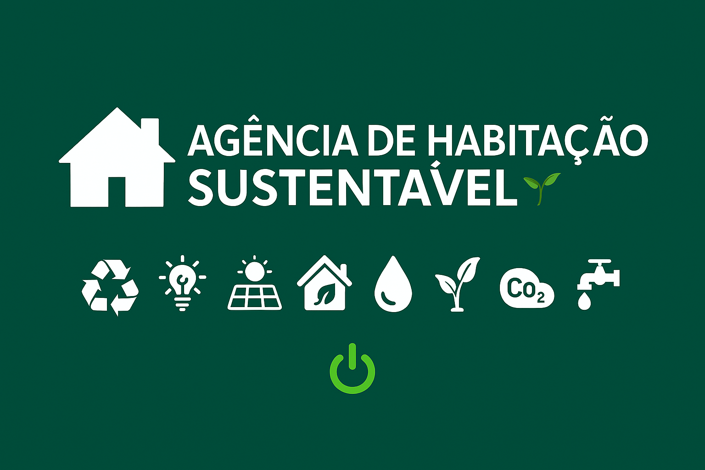
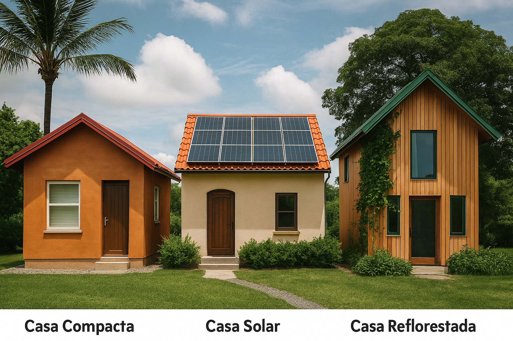
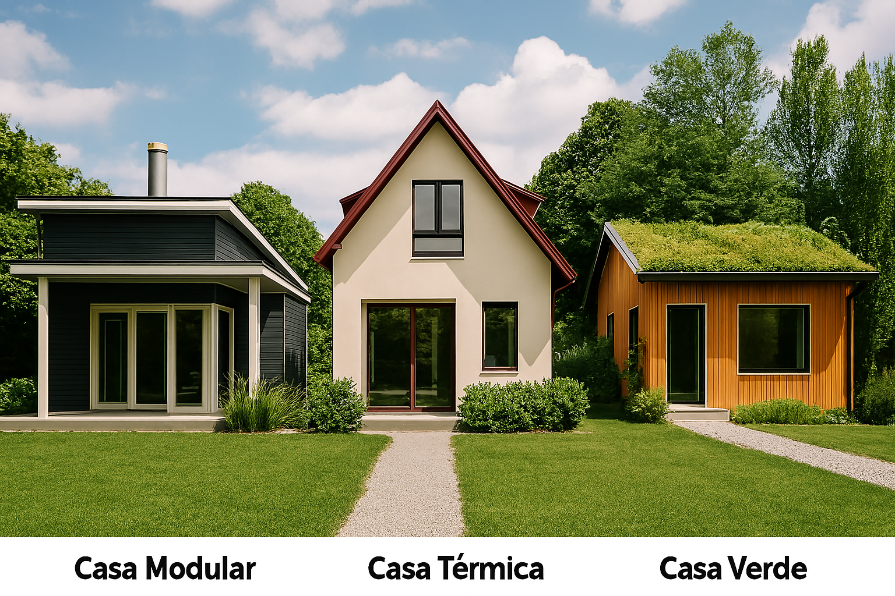
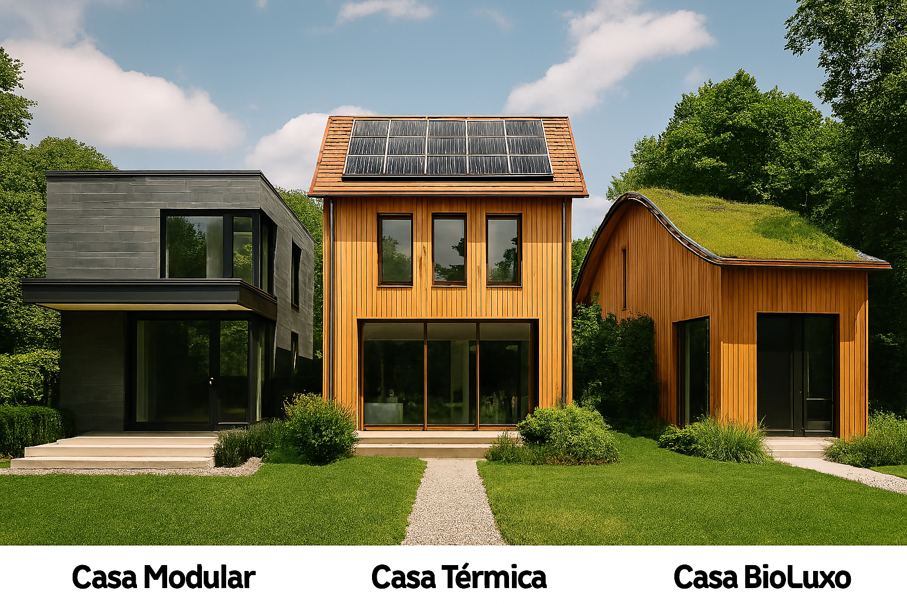

# 🌱 Agência de Habitação Sustentável

<p align="center">
  
</p>

Bem-vindo à **Agência de Habitação Sustentável**, uma aplicação interativa desenvolvida em **Python** que simula a escolha e aquisição de casas com diferentes níveis de sustentabilidade.  
O sistema foi construído com a arquitetura **MVC (Model-View-Controller)**, garantindo organização, escalabilidade e facilidade de manutenção.

---

## 🚀 Funcionalidades

- 👤 Cadastro de cliente  
- 🏡 Escolha entre casas **Básicas**, **Medianas** ou **Avançadas**  
- 🔍 Visualização de até 3 opções por categoria  
- 📋 Detalhes completos da casa selecionada  
- 🌿 Características adicionais específicas por tipo de casa  
- 🧾 Confirmação de compra com **recibo elegante** ao final  

---

## 🧱 Estrutura do Projeto

```bash
📁 projeto/
├── model.py         # Classes Cliente e Habitação
├── controller.py    # Lógica de negócio e dados das casas
├── view.py          # Interface com o usuário (CLI)
├── imagens/         # Imagens ilustrativas para o README
└── README.md        # Documentação do projeto
```

---

## 🏡 Tipos de Casas Sustentáveis

### Casas Básicas
<p align="center">
  
</p>

- **Casa Compacta**: pequena, eficiente, com captação de água da chuva.  
- **Casa Solar**: equipada com painéis solares e materiais recicláveis.  
- **Casa Reflorestada**: integrada à natureza com jardim vertical e compostagem.

---

### Casas Medianas
<p align="center">
  
</p>

- **Casa Modular**: estrutura flexível e ventilação cruzada.  
- **Casa Térmica**: isolamento térmico e aquecimento solar.  
- **Casa Verde**: telhado verde e irrigação automatizada.

---

### Casas Avançadas
<p align="center">
  
</p>

- **Casa EcoLuxo**: automação completa e certificação LEED.  
- **Casa Premium**: energia solar com bateria e acabamentos ecológicos.  
- **Casa BioLuxo**: bioconstrução com purificação de ar e design biofílico.

---

## 📦 Requisitos

- Python 3.10 ou superior  
- Terminal ou IDE com suporte à entrada de dados via `input()`

---

## ▶️ Como Executar

1. Clone o repositório:
   ```bash
   git clone https://github.com/seu-usuario/agencia-habitacao-sustentavel.git
   cd agencia-habitacao-sustentavel
   ```

2. Execute o programa:
   ```bash
   python view.py
   ```

---

## 👨‍💻👨‍💻 Desenvolvido com carinho por apaixonados por código

- Gustavo Lima  
  [GitHub: gustavolima37](https://github.com/gustavolima37)  
- Marcia Jacó  
  [GitHub: marciaeujc-pixel](https://github.com/marciaeujc-pixel)

<p align="center">
  
  
</p>
